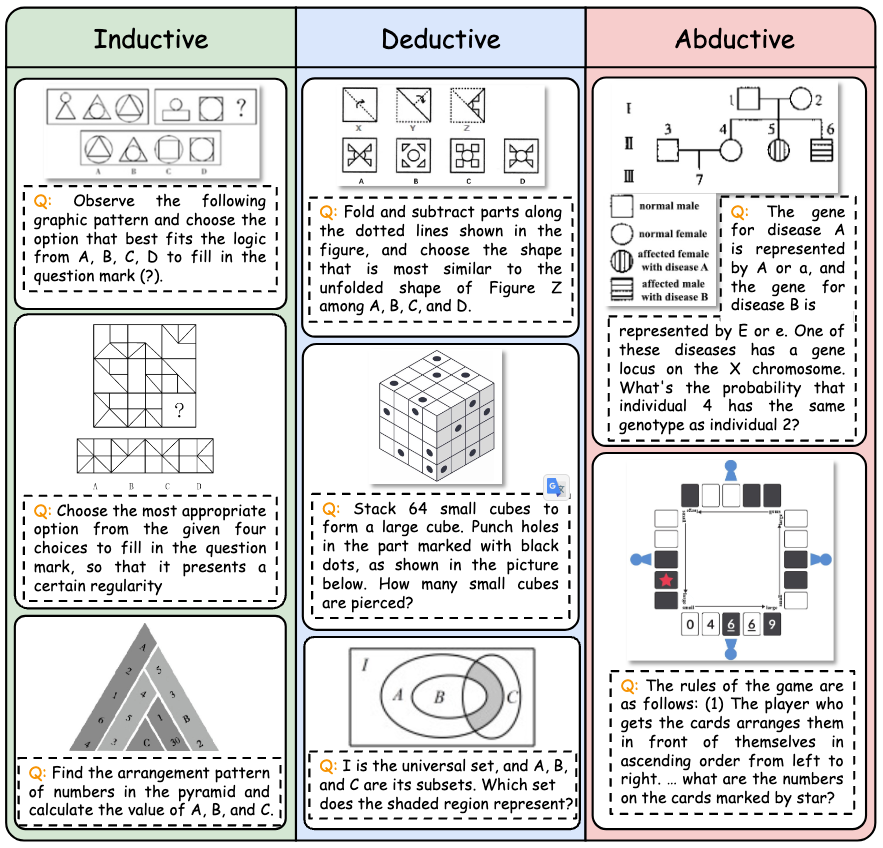
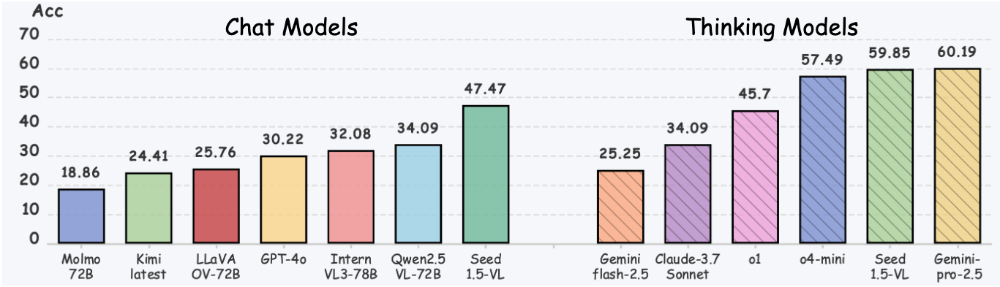

# MME-Reasoning 🔥: A Comprehensive Benchmark for Logical Reasoning in MLLMs

 
 
 


 

Official repository for "[MME-Reasoning: A Comprehensive Benchmark for Logical Reasoning in MLLMs]()".

🌟 For more details, please refer to the project page.

[[🚀Project Page](https://alpha-innovator.github.io/mmereasoning.github.io/)] [[📖 Paper]()] [[📊 Huggingface Dataset]()] [[🏆 Leaderboard](https://alpha-innovator.github.io/mmereasoning.github.io/#leaderboard)]

## 💥 News
- **[2025.05.23]** 🔥 We launch MME-Reasoning, a comprehensive benchmark designed to evaluate the reasoning ability of MLLMs. We release the [arxiv paper]() and all data samples in [huggingface dataset]().

## 👀 About MME-Reasoning

Logical reasoning is a fundamental aspect of human intelligence and an essential capability for multimodal large language models (MLLMs). Existing benchmarks fail to comprehensively evaluate MLLMs reasoning abilities due to the lack of explicit categorization for logical reasoning types and an unclear understanding of reasoning.

In this paper, we introduce **MME-Reasoning**, a comprehensive benchmark specifically designed to evaluate the reasoning capability of MLLMs. MME-Reasoning consists of 1,188 carefully curated questions that systematically cover types of logical reasoning (**inductive**, **deductive**, and **abductive**), while spanning a range of difficulty levels.

<p align="center">
     <br>
</p>

Experiments were conducted on state-of-the-art MLLMs, covering Chat and Thinking types of both open-source and closed-source. Evaluations with MME-Reasoning reveal these key findings: **(1) MLLMs exhibit significant limitations and pronounced imbalances in reasoning capabilities.** **(2) Abductive reasoning remains a major bottleneck for current MLLMs.** **(3) Reasoning length scales with task difficulty, benefiting performance but accompanied by marginal effects and decreasing token efficiency.** We hope MME-Reasoning serves as a foundation for advancing multimodal reasoning in MLLMs.

<p align="center">
     <br>
</p>

## Inference

We are working to integrate the MME-Reasoning into existing VLMs evaluation frameworks. For the current version of the evaluation, please following the follows steps:

1. Setup your environment following [VLMEvalKit](./README_VLMEVAL.md)
2. Download MME-Reasoning data and metadata from [huggingface]().
3. Set environment variable `LMUData` (note the images should exist under `$LMUDATA/MMEReasoning/images/`)
4. Set the metadata path in `vlmeval/dataset/mmereasoning/mmereasoning.py` in `line 19` and `line 25`.
5. Run:
     ```python
     python run.py --data MMEReasoning --model your_model --mode infer --verbose
     ```
6. Extract and judge the final results:
     ```python
     python test_mme_reasoning.py --file_path response_file
     ```
     The response file exists in outputs dir and ends with scores.xlsx.

## 🏆 Leaderboard

### Contributing to the Leaderboard

🚀 The [Leaderboard](https://alpha-innovator.github.io/mmereasoning.github.io/#leaderboard) is continuously being updated, welcoming the contribution of your excellent MLLMs!

To contribute your model to the leaderboard, please email the prediction files to 📧[jkyuan112@gmail.com](mailto:jkyuan112@gmail.com) or [pengts521@gmail.com](mailto:pengts521@gmail.com).


## :white_check_mark: Citation

If you find **MME-Reasoning** useful for your research and applications, please kindly cite using this BibTeX:

```latex

```